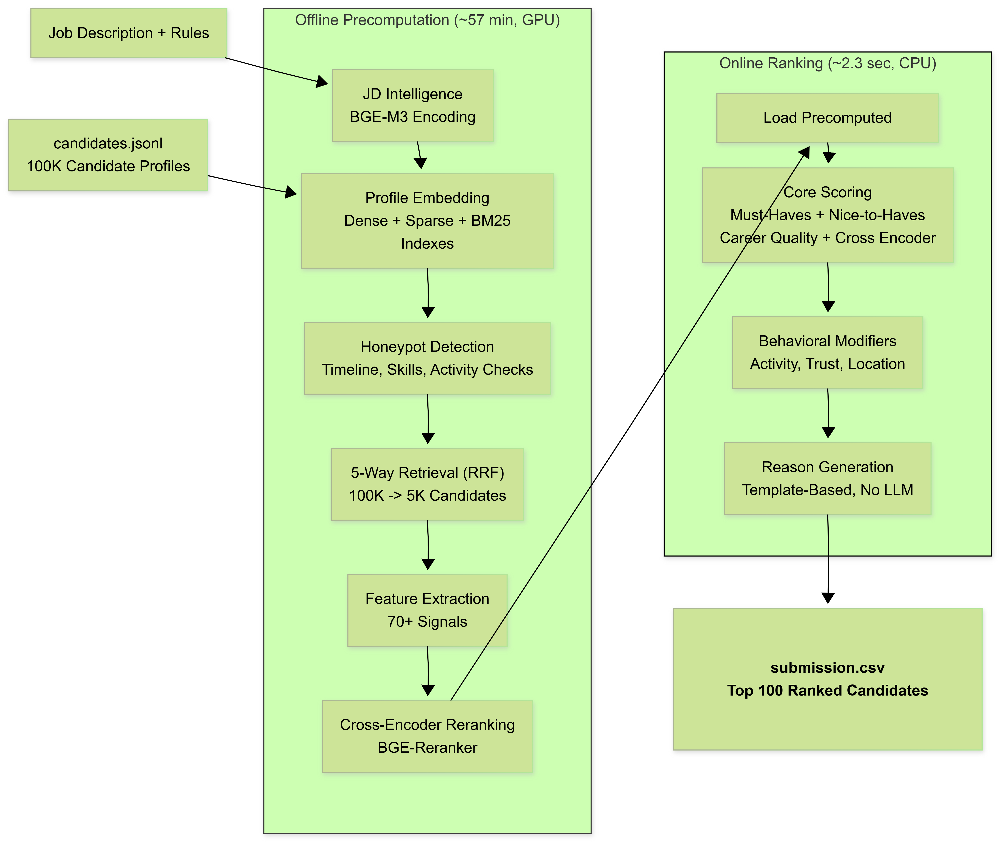

# Evidence Rank — Team BuriBuri

> **Redrob Hackathon** · Intelligent Candidate Discovery & Ranking Challenge  
> Rank the top 100 ML Engineer candidates from a 100,000-candidate pool — in under 5 seconds on CPU.

---

## Quick Start

### 1. Setup
* Place the `candidates.jsonl` file directly in the repository root directory (i.e., `./candidates.jsonl`).
* The precomputed artifacts required for CPU ranking are included in the `artifacts/` folder of this repository.

### 2. Run
```bash
# Install dependencies
pip install -r requirements.txt

# Run the CPU ranker (completes in ~2.3 seconds)
python rank.py --candidates ./candidates.jsonl --out ./team_BuriBuri.csv

# Validate format compliance
python validate_submission.py team_BuriBuri.csv
```

### 3. Running Tests
The unit test suite validates scoring formulas, re-ranking multipliers, location bands, reason generation, and sparse matrix arithmetic. Run all tests with:
```bash
pytest -v
```

> **Runtime:** ~2.3 sec · **RAM:** < 1 GB · **Compute:** CPU only · **Network:** None

---

## Architecture

The system utilizes an offline-online hybrid architecture designed to achieve sub-second execution on CPU at runtime while maintaining deep search capabilities. 

This design was finalized after multiple planning iterations, comprehensive retrieval-scoring experiments and deliberate engineering trade-offs between offline feature pre-computation and runtime compute constraints.



### Offline Pre-computation — `preprocess.py` (~57 min on T4 GPU)

**Phase 0 — JD Intelligence**  
The Job Description contract (`metadata/JD_contract.yaml`) is encoded using `BAAI/bge-m3` into dense + sparse query vectors. These become the retrieval anchors for the entire pipeline.

**Phase 1 — Corpus Embedding**  
All 100,000 candidate profiles are encoded with `BAAI/bge-m3`:
- Dense vectors → FAISS `IndexFlatIP` (cosine similarity, dim=1024)
- Sparse vectors → SciPy CSR matrix (learned lexical weights)
- BM25 index → tokenized profile text for lexical fallback

**Phase 1f — Honeypot Detection**  
All 100,000 candidates are scanned for impossible profiles before any ranking:
- Timeline contradictions (e.g., 8 years at a 3-year-old company)
- Skill impossibilities (expert in 10 skills with 0 years of use)
- Ghost profiles (no recent activity, no verifiable signals)

Flagged candidates receive a score penalty that naturally pushes them below rank 100.

**Phase 1d — RRF Retrieval**  
Five signals are fused using Reciprocal Rank Fusion (RRF) to produce a shortlist of the top **5,000** candidates:
1. BGE-M3 dense cosine similarity
2. BGE-M3 sparse lexical similarity
3. BM25 keyword match
4. Title-query match
5. Skill-query match

**Phase 1c — Feature Extraction**  
The top 5,000 candidates have 70+ features extracted by a handcrafted regex engine across three buckets:
- **Bucket A (Must-Haves):** Semantic search, vector DB, retrieval/ranking, NLP/LLM product experience
- **Bucket B (Nice-to-Haves):** MLOps, recommendations, evaluation pipelines, knowledge graphs
- **Bucket C (Career Quality):** Product company ratio, title progression, seniority, recency

**Phase 1e — Cross-Encoder Scoring**  
`BAAI/bge-reranker-v2-m3` scores all top-5,000 candidate-JD pairs offline. The score is stored and merged at runtime, eliminating any GPU requirement at inference time.

---

### Online Ranking — `rank.py` (~2.3 sec on CPU)

**Phase 4 — Core Scoring**  
A vectorized Polars formula merges all precomputed features into a 0-100 `core_score`, then blends in the normalized cross-encoder `ce_score` at an 80/20 ratio. Cross-encoder inference is precomputed for the top 5,000 RRF candidates; runtime ranking applies the blend to the current top slice.

**Phase 5 — Behavioral Modifiers**  
Strict modifiers applied to the top 500, using 18 of 23 Redrob behavioral signals:

| Signal | How it's used |
|--------|--------------|
| `notice_period_days` | Hard penalty for 90+ day notice |
| `open_to_work_flag` | Availability boost |
| `recruiter_response_rate` | Responsiveness multiplier |
| `avg_response_time_hours` | Responsiveness multiplier |
| `interview_completion_rate` | Hiring intent signal |
| `offer_acceptance_rate` | Hiring intent signal |
| `github_activity_score` | Technical activity boost |
| `saved_by_recruiters_30d` | Market demand signal |
| `skill_assessment_scores` | Verified skill trust score |
| `endorsements_received` | Peer validation multiplier |
| `profile_completeness_score` | Base quality floor |
| `last_active_date` | Recency / ghost detection |
| `applications_submitted_30d` | Active job-seeking signal |
| `preferred_work_mode` | Location / remote fit |
| `willing_to_relocate` | Location / remote fit |
| `verified_email` | Profile authenticity |
| `verified_phone` | Profile authenticity |
| `linkedin_connected` | Profile authenticity |

*Unused signals (5/23): `signup_date`, `profile_views_received_30d`, `connection_count`, `expected_salary_range_inr_lpa`, `search_appearance_30d`*

**Phase 6 — Reasoning**  
For the final top 100, a 1–2 sentence reasoning string is assembled from actual extracted values in the candidate's profile. No LLM is called. Every claim corresponds to a real, verified field from the data.

---

## Evaluation Metrics

The submission is scored against a hidden ground truth using:

| Metric | Weight | What it measures |
|--------|--------|-----------------|
| NDCG@10 | **0.50** | Quality of top-10 picks |
| NDCG@50 | **0.30** | Quality of top-50 picks |
| MAP | **0.15** | Precision across all relevance levels |
| P@10 | **0.05** | Fraction of top-10 that are tier 3+ relevant |

**Final composite = 0.50 × NDCG@10 + 0.30 × NDCG@50 + 0.15 × MAP + 0.05 × P@10**

> Honeypot rate > 10% in top 100 → automatic disqualification at Stage 3.

---

## Rerun Lifecycle

| Change made | What to rerun |
|-------------|--------------|
| `weights.yaml` only | `rank.py` only |
| `src/scorer.py`, `src/behavioral.py`, `src/explainer.py` | `rank.py` only |
| `src/features.py` or honeypot logic | `preprocess.py --skip-embed` → `rank.py` |
| `metadata/JD_contract.yaml` (signal terms) | `preprocess.py --skip-embed` → `rank.py` |
| `metadata/JD_contract.yaml` (retrieval/query terms) | Full `preprocess.py` (GPU required) |
| Candidate data or embedding model | Full `preprocess.py` (GPU required) |

### Partial Rerun (Skip 57-minute Embedding)

```bash
python preprocess.py --candidates ./candidates.jsonl --skip-embed
python rank.py --candidates ./candidates.jsonl --out ./team_BuriBuri.csv
```

---

## Pre-computation (GPU Required — Run Once)

The embedding step requires a GPU environment (Google Colab T4 or equivalent).

```bash
# Install all dependencies
pip install -r requirements.txt

# Run the full offline pipeline
python preprocess.py --candidates ./candidates.jsonl

# Smoke test with 50 sample candidates first (recommended)
python preprocess.py --sample
```

Outputs are saved to the `artifacts/` folder. Once generated, `rank.py` runs entirely on CPU.

---

## Project Structure

```
evidence-rank/
├── preprocess.py              # Offline GPU pipeline (Phases 0, 1, 1f, 1d, 1c, 1e)
├── rank.py                    # Fast CPU ranker (Phases 4, 5, 6)
├── app.py                     # Gradio sandbox + CLI runner (no artifacts needed)
├── constants.py               # All file paths and model IDs
├── weights.yaml               # All scoring weights (tunable without rerun)
├── submission_metadata.yaml   # Hackathon submission metadata
├── requirements.txt           # All dependencies
│
├── src/
│   ├── features.py            # Phase 1c: regex feature extraction
│   ├── scorer.py              # Phase 4: core scoring formula
│   ├── behavioral.py          # Phase 5: behavioral modifiers
│   ├── explainer.py           # Phase 6: reason generation
│   ├── jd_intelligence.py     # Phase 0: JD query builder
│   └── reranker.py            # Cross-encoder scoring utility
│
├── metadata/
│   └── JD_contract.yaml       # Job Description signal contract (rubric)
│
└── artifacts/                 # Generated by preprocess.py
    ├── faiss_index.bin
    ├── candidate_sparse_matrix.npz
    ├── bm25_index.pkl
    ├── retrieval_scores.parquet
    ├── candidate_features.parquet
    ├── cross_encoder_scores.parquet
    └── candidate_flags.parquet
```

---

## Sandbox Demo

Live heuristic sandbox on HuggingFace Spaces (no GPU, no artifacts):  
**https://huggingface.co/spaces/sathvik1610/evidence-rank**

### CLI (local, same logic):

```bash
python app.py --candidates ./sample_candidates.json --out output.csv
python app.py --candidates ./candidates.jsonl --out output.csv
python app.py --candidates ./candidates.jsonl.gz --out output.csv
```

### Gradio UI (local):

```bash
python app.py
# Open http://localhost:7860
```

The sandbox runs Phases 1f + 1c + 4 + 5 + 6 using pure heuristics. Dense retrieval and cross-encoder are disabled. No `artifacts/` folder needed.

---

## Submission Spec Compliance

- [x] Exactly 100 rows, header `candidate_id,rank,score,reasoning`
- [x] All candidate IDs exist in `candidates.jsonl`
- [x] Ranks 1–100 each appear exactly once
- [x] Scores monotonically non-increasing by rank
- [x] Ties broken by `candidate_id` ascending
- [x] UTF-8 CSV
- [x] `rank.py` runs in 2.3 seconds (well under 5-minute limit)
- [x] No GPU during ranking
- [x] No external API calls during ranking
- [x] 18/23 Redrob behavioral signals used
- [x] Honeypot detection implemented (Phase 1f)
- [x] Reasoning is specific, non-templated, hallucination-free
- [x] `submission_metadata.yaml` present at repo root
- [x] Working sandbox provided
