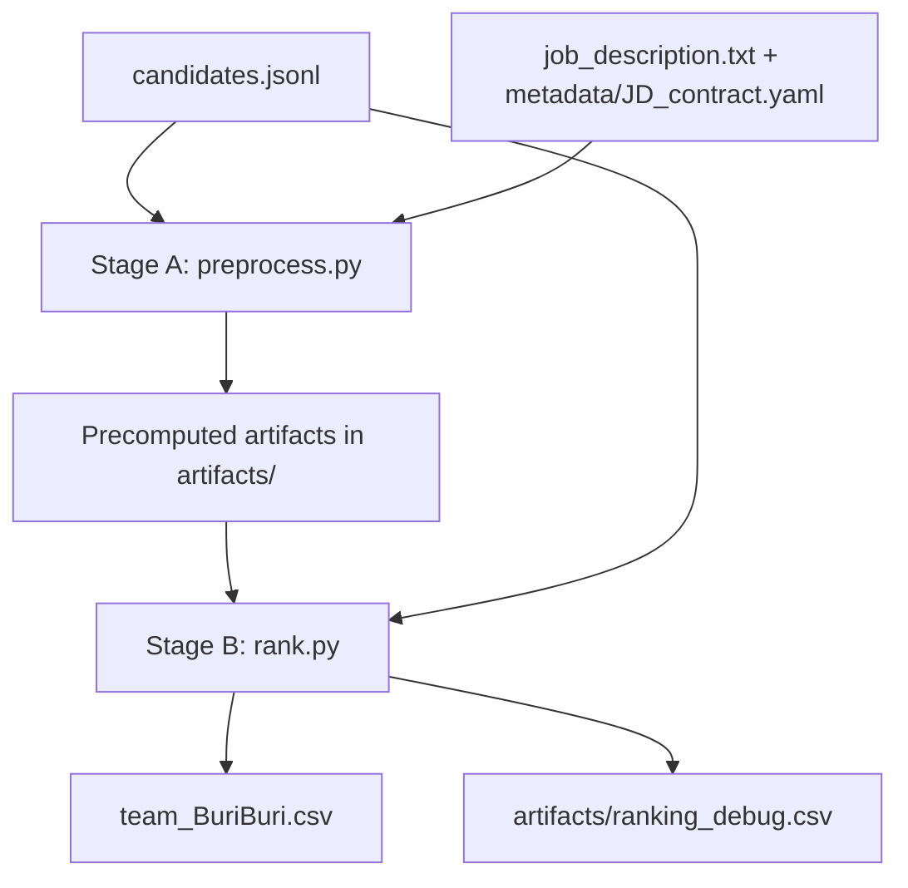
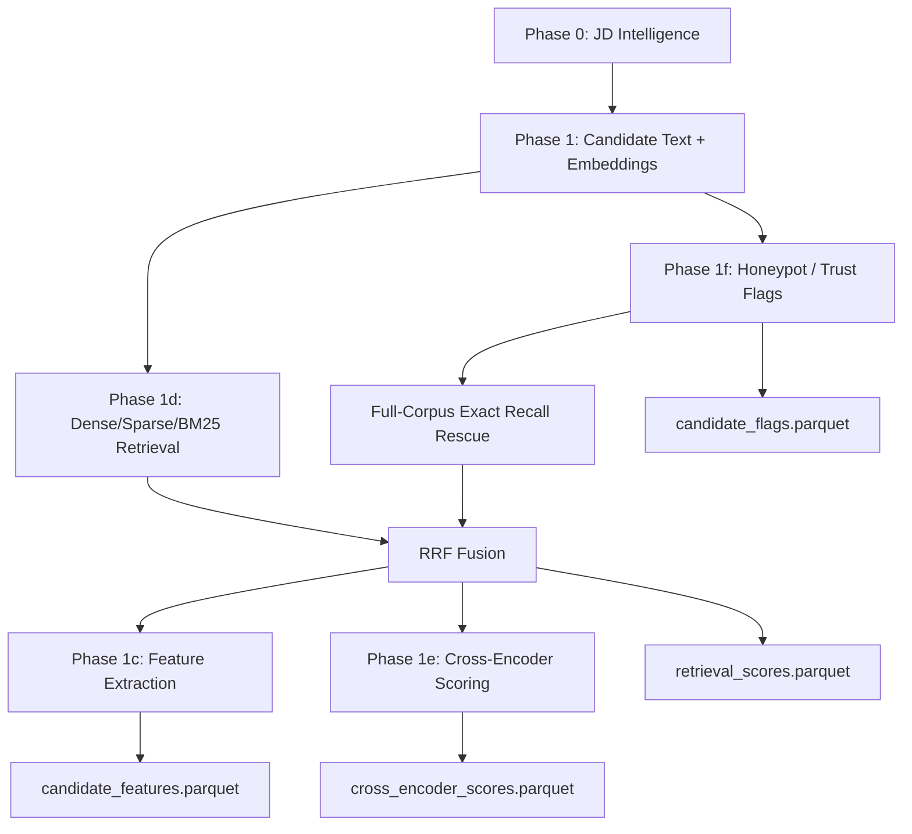
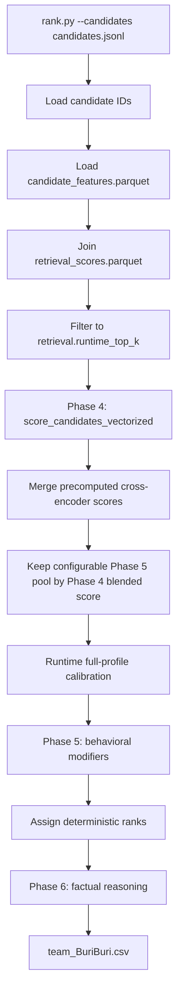
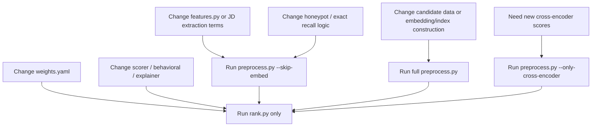

# Evidence Rank Architecture

This document explains how Team BuriBuri's Redrob ranking engine works end to end. It is written for code reviewers, evaluators, and team members who need to understand and defend the implementation.

## Design Goal

The JD is for a founding-team Senior AI Engineer who will own candidate-role matching, retrieval, ranking, and evaluation systems. The system therefore does not simply search for generic AI keywords. It tries to identify candidates who have actually built production retrieval, search, recommendation, ranking, hybrid search, and ranking-evaluation systems.

The submission spec makes top-rank quality the main target:

| Metric | Weight | Meaning |
|---|---:|---|
| NDCG@10 | 0.50 | Quality and order of the top 10 |
| NDCG@50 | 0.30 | Quality and order of the top 50 |
| MAP | 0.15 | Precision across the ranked list |
| P@10 | 0.05 | Fraction of top 10 that are relevant |

The architecture is built around that reality: high recall first, then careful top-100 reranking, with factual reasoning for manual review.

## Dataset Interpretation Assumptions

The participant bundle names several trap types, including behavioral twins and approximately 80 subtly impossible honeypots. It does not state that every duplicated role paragraph is an automatic honeypot or invalid candidate. Local corpus checks found exact long role descriptions repeated across different companies in a substantial fraction of the synthetic dataset, so the system treats this as a noisy evidence pattern rather than a hard fraud signal.

The implemented assumption is conservative: exact repeated descriptions inside one candidate count as one semantic evidence block for retrieval/ranking/evaluation depth. The original roles still contribute their structural facts, such as company, tenure, current-role status, title, industry, company size, and Redrob behavioral signals. This means copied text cannot inflate sustained-career depth, while a candidate is not discarded solely because the synthetic profile reused a paragraph.

Company size and employer context are deliberately small corroborative signals. Large product-company exposure can support confidence that a candidate has operated in mature production environments, but it is not allowed to dominate the score because the JD favors scrappy product builders over brand pedigree.

Career-density extraction is calibrated to the JD's own vocabulary. The JD asks for embeddings, retrieval, ranking, evaluation frameworks, and the ability to ship a working ranker; therefore singular or compound role language such as `embedding-based search`, `embedding ranker`, and `ranker variants` is counted as core evidence. Generic A/B language is guarded: `A/B testing` only contributes to evaluation density when it appears inside a role that already has search, retrieval, ranking, recommendation, or matching evidence. This prevents growth-marketing experimentation from being mistaken for ranking-system evaluation while preserving the JD-relevant offline-to-online evaluation signal.

## High-Level Flow



The expensive work is in `preprocess.py`. The final competition path is `rank.py`, which only reads artifacts and writes the final CSV.

## Stage A: Offline Preprocessing

Stage A can use GPU and can take longer. It produces reusable artifacts that make final ranking fast and reproducible. Its main quality objective is recall: the system should avoid throwing away plausible top-tier candidates before the more careful scoring and behavioral layers see them.



### Phase 0: JD Intelligence

Code:

- `src/jd_intelligence.py`
- `metadata/JD_contract.yaml`
- `job_description.txt`

Outputs:

- `artifacts/jd_config.json`
- `artifacts/jd_keywords.json`
- `artifacts/jd_v1_skills.npy`
- `artifacts/jd_hyde_recsys.npy`
- `artifacts/jd_hyde_eval.npy`
- `artifacts/jd_sparse_queries.npz`

What happens:

- Reads the JD and structured YAML contract.
- Builds dense JD query text for BGE-M3.
- Builds HyDE-style retrieval personas for recommender/ranking and evaluation-heavy candidates.
- Builds learned-sparse JD vectors and BM25 keyword anchors.
- Disables ColBERT vectors to avoid memory-heavy artifacts.

Why:

- The JD rewards intent understanding, not keyword matching only.
- Separate query views help recall profiles that say "recommendation systems" or "ranking evaluation" without saying "RAG".

### Phase 1: Candidate Corpus Preprocessing

Code:

- `preprocess.py`
- `constants.py`

Outputs:

- `artifacts/faiss_index.bin`
- `artifacts/candidate_sparse_matrix.npz`
- `artifacts/bm25_index.pkl`
- `artifacts/candidate_texts.pkl`
- `artifacts/candidate_ids.json`

What happens:

- Serializes each candidate profile into searchable text.
- Encodes text with `BAAI/bge-m3`.
- Stores normalized dense embeddings in FAISS `IndexFlatIP`.
- Stores learned-sparse lexical weights in SciPy CSR format.
- Builds a BM25 index over normalized candidate text.

Why:

- Dense search captures semantic fit.
- Learned sparse and BM25 keep exact technical terms alive.
- Runtime ranking should not load models or rebuild indexes.

### Phase 1f: Honeypot And Trust Checks

Code:

- `preprocess.py`
- `src/features.py`
- `metadata/JD_contract.yaml`

Output:

- `artifacts/candidate_flags.parquet`

What happens:

- Reads raw JSON fields directly.
- Flags impossible timelines, negative durations, suspicious years of experience, multiple current roles, ghost profiles, consulting-only risks, research-only risks, wrong-domain risks, and target skill-duration overclaims.

Why:

- The spec warns that honeypots are forced to low relevance.
- These checks should be structural and deterministic, not embedding-based.

### Phase 1d: Multi-Signal Retrieval

Output:

- `artifacts/retrieval_scores.parquet`
- `artifacts/retrieval_scores_base.parquet`

Signals:

- dense FAISS retrieval over BGE-M3 vectors
- learned-sparse BGE-M3 CSR dot product
- BM25 lexical retrieval
- exact/regex recall lane over JD-critical terms
- Reciprocal Rank Fusion over the retrieval lists

Why:

- Dense-only retrieval misses exact evaluation/system terms.
- BM25-only retrieval misses semantic recommender/search profiles.
- The exact recall lane scans the full 100K candidate corpus and rescues profiles with explicit career evidence for retrieval, recommendation, ranking, vector/hybrid search, evaluation, Python, and production ownership.
- RRF gives a robust high-recall candidate pool before scoring, while avoiding dependence on any single retrieval method.

### 100K To 12.3K Reliability

The current artifacts reduce 100,000 candidates to a 12,567-candidate feature pool. This is a recall-first funnel, not a precision filter. The pool is the union of:

| Recall source | Role in the funnel |
|---|---|
| Dense BGE-M3 JD queries | captures semantic matches to the JD even when exact wording differs |
| Learned-sparse BGE-M3 queries | keeps model-derived lexical anchors and technical terms alive |
| BM25 | preserves exact evidence such as BM25, FAISS, Pinecone, NDCG, MRR, MAP, and Python |
| Exact full-corpus rescue | scans all 100K raw profiles for field-aware JD-critical evidence |

The exact rescue lane is intentionally field-aware: career descriptions and titles count more than skills-only claims. It requires a primary retrieval/ranking/recommendation/search signal before adding related vector, evaluation, Python, or production evidence. This suppresses generic AI keyword stuffing while still rescuing sparse but relevant profiles.

Current reliability checks on the generated artifacts:

| Check | Result |
|---|---:|
| Retrieval pool after fusion | 12,567 |
| Feature rows generated | 12,567 |
| Cross-encoder rows available | 12,325 |
| Exact recall top-10K missing from retrieval pool | 0 |
| Final top-100 outside retrieval/features | 0 |
| Final top-100 flagged impossible/suspicious/ghost | 0 |

The residual risk is a candidate whose profile is semantically similar enough to rank just outside the semantic base but lacks enough explicit exact-recall evidence to be rescued. That risk cannot be driven to zero without scoring all 100K in detail, but it is acceptable for this challenge because the exact lane is broad, the feature pool is over 12% of the corpus, and the final top-100 all come from the high-confidence semantic base.

### Phase 1c: Feature Extraction

Code:

- `src/features.py`

Output:

- `artifacts/candidate_features.parquet`

Feature groups:

- Bucket A: retrieval/search, vector DB, evaluation, LTR/reranking, Python, LLM/RAG, distributed systems, HR-tech exposure
- Bucket B: product-company ratio, deployment language, shipper language, ownership, recency, depth, career IR density
- Bucket C: title velocity, consulting/research/wrong-domain risks, LangChain-only risk, keyword stuffing, stopped-coding risk, contradiction flags

Why:

- The final ranker needs explicit, interpretable JD features.
- The explainer also needs factual snippets copied from candidate text.

### Phase 1e: Cross-Encoder Scoring

Code:

- `src/reranker.py`
- `preprocess.py`

Output:

- `artifacts/cross_encoder_scores.parquet`

What happens:

- Runs `BAAI/bge-reranker-v2-m3` offline on the widened retrieval pool.
- Saves normalized scores for runtime merge.

Why:

- The cross-encoder adds semantic ordering quality.
- It is not run during final ranking, keeping `rank.py` fast and CPU-safe.

## Stage B: Runtime Ranking

Stage B is the official reproducible path. It should complete within 5 minutes on CPU with no network and no GPU.



### Runtime Step Details

1. `rank.py` reads candidate IDs from the input JSONL.
2. It loads `artifacts/candidate_features.parquet`.
3. It filters artifacts to the candidate IDs present in the input file.
4. It joins `artifacts/retrieval_scores.parquet`.
5. It keeps the configured runtime retrieval pool from `weights.yaml`.
6. `src/scorer.py` computes the core technical score.
7. `src/reranker.py` merges precomputed cross-encoder scores.
8. The pipeline keeps a configurable Phase 5 pool by blended Phase 4 score. The current value is `ranking.phase5_candidate_pool = 1000`, which leaves room to backfill the official Top 100 after strict JD hard gates remove ineligible profiles.
9. `src/runtime_calibration.py` cheaply reads full profile text for current/recent full-plan JD fit and current services context.
10. `src/behavioral.py` applies final reachability and trust modifiers.
11. Ranks are assigned by descending score, with deterministic tie handling.
12. `src/explainer.py` generates the final reasoning text.
13. The system writes `team_BuriBuri.csv`.

## Scoring Model


Core bucket weights from `weights.yaml`:

| Bucket | Weight |
|---|---:|
| Must-have evidence | 0.55 |
| Nice-to-have evidence | 0.05 |
| Career quality | 0.15 |
| Product-builder score | 0.25 |

Must-have sub-weights:

| Signal | Weight |
|---|---:|
| Retrieval/search evidence | 0.22 |
| Vector DB / hybrid search | 0.16 |
| Recommendation/ranking systems | 0.20 |
| Evaluation framework | 0.17 |
| Python engineering | 0.05 |

Cross-encoder merge:

| Component | Weight |
|---|---:|
| Handcrafted core score | 0.68 |
| Precomputed cross-encoder score | 0.32 |

## Behavioral And Trust Layer

Behavioral signals are late modifiers. They do not replace technical fit.

Signals include:

- last active date
- open-to-work flag
- recruiter response rate
- notice period
- location and relocation
- seniority and hands-on coding risk
- writing signal
- social proof and GitHub activity
- interview completion and offer acceptance
- profile completeness
- honeypot, ghost, and contradiction penalties
- current services/consulting context
- full-profile current/recent evidence of retrieval + vector/hybrid + ranking + evaluation + shipping

Why late modifiers:

- A technically weak but highly available candidate should not outrank a strong JD match.
- A strong but unreachable candidate should still be penalized because the JD asks for real hiring practicality.

## Postprocessing And Final Reranking

The final top-100 is not the raw retrieval order. Postprocessing exists because the JD is a hiring problem, not a document-search benchmark.

After the offline preprocessing shrinks the 100,000 corpus to a 12,567-candidate feature pool, `rank.py` shrinks this down to the final 100 through specific stages:

1. **Stage 1 (Retrieval Cutoff):** applies the configured runtime RRF cutoff to slice 12,567 -> 10,000.
2. **Stage 2 (Feature Scoring):** computes explicit JD feature scores and blends handcrafted scoring with precomputed cross-encoder scores for the 10,000.
3. **Stage 3 (Phase 5 Pool Cutoff):** keeps the top 1,000 candidates by blended Phase 4 score for deep evaluation (10,000 -> 1,000).
4. **Stage 4 (Calibration & Modification):** reads full profile text for the top 1,000, applies JD hard gates (removing strict disqualifiers), and applies behavioral, logistics, trust, notice-period, location, and social-proof modifiers.
5. **Stage 5 (Final Cut):** assigns deterministic ranks to the remaining valid candidates and slices the absolute Top 100 (1,000 -> 100).
6. **Stage 6 (Reasoning):** generates factual reasoning from profile facts and extracted snippets exclusively for the Top 100.

This postprocessing is where the system becomes recruiter-aligned. A candidate with missing production retrieval/vector/evaluation/Python evidence or an explicit JD disqualifier is removed from Top-100 eligibility before final ranking. The Python gate is strict about evidence but not literal-string-only: explicit Python, Python libraries, Python-native ML tooling such as MLflow/Kubeflow, or FAISS in a hands-on ML/search engineering context can prove the requirement. Generic vector-database mentions alone do not. Candidates that pass those gates can still move down sharply if they look hard to reach, have a 120-day notice period, have weaker location/relocation logistics, show current services/consulting risk, or carry trust/overclaim concerns. Conversely, a profile with strong current evidence across retrieval, vector/hybrid search, ranking, evaluation, and shipping can be lifted when the raw feature extraction underestimates the complete profile.

This is deliberate. The JD says the ideal output is not a list of the most AI-keyword-heavy profiles; it is a ranked shortlist of people who can plausibly be hired and succeed in the first 90 days.

## Reasoning Generation

The `reasoning` column is generated by `src/explainer.py`.

Rules:

- no LLM calls
- no hosted APIs
- no guessing
- profile facts come from extracted JSON fields
- evidence snippets come from candidate text snippets saved in features
- contradiction flags prevent unverified duration claims
- top candidates sound strong
- mid candidates show fit plus caveats
- lower top-100 candidates are described as partial or adjacent fits

This is intentional. Deterministic reasoning may repeat some structure, but it is safer than generative prose that could hallucinate facts.

## Output Files

Official output:

```text
team_BuriBuri.csv
```

Columns:

```text
candidate_id,rank,score,reasoning
```

Debug output:

```text
artifacts/ranking_debug.csv
```

Debug columns include:

- `candidate_id`
- `rank`
- `score`
- `core_score`
- `ce_score`
- `top100_must_have_exclusion`
- `notice_risk`
- `location_risk`
- `hard_disqualified`
- `hard_disqualification_reason`
- `reasoning`
- `concern`

Hard-gated candidates are written separately to:

```text
artifacts/hard_disqualified_debug.csv
```

This file records the exclusion reason and the relevant must-have/disqualifier/logistics flags. Official Top 100 ranking is built only from candidates that pass the hard gates.

## Current Runtime And Output Metrics

| Metric | Current value |
|---|---:|
| Candidates in official dataset | 100000 |
| Candidates loaded from current feature artifact during rank run | 12567 |
| Runtime retrieval cutoff | 10000 |
| Phase 5 candidate pool | 1,000 |
| Final output rows | 100 |
| Runtime for latest `rank.py` run | about 5.0 seconds locally |
| Full tests | 113 passed |
| Submission validator | Pass |
| Reasoning factuality audit | 100 rows checked, 0 errors, 0 warnings |
| Score range in final CSV | 99.97 to 46.49 |
| Mean score | 62.36 |
| Median score | 58.42 |

## Artifact Dependency Rules



Use `rank.py` only when the change affects scoring, hard gates, behavior, or explanation over existing features. Rebuild preprocessing when the change affects what features or retrieval candidates exist.

### Should Full Preprocessing Be Rerun?

The current artifacts have been regenerated with `preprocess.py --skip-embed` after the latest feature-extraction and hard-gate changes. That is enough for contract/regex/feature fixes because it rebuilds flags, exact recall, retrieval rows, and `candidate_features.parquet` while reusing the expensive dense/sparse/BM25 base artifacts. When only `rank.py`, `src/behavioral.py`, `src/explainer.py`, or `weights.yaml` changes, `rank.py` alone is usually enough; when `metadata/JD_contract.yaml` or `src/features.py` changes, run `preprocess.py --skip-embed` before ranking.

A full preprocessing rerun would be justified if:

- the candidate dataset changes,
- the embedding model or JD query text changes,
- the semantic retrieval base must be widened from older artifacts,
- cross-encoder scores need to be regenerated for a changed retrieval pool,
- feature extraction or exact-recall rules changed and the cheaper `--skip-embed` rebuild is not sufficient.

A full embedding/cross-encoder rerun may not produce the exact same CSV. If the semantic retrieval base or cross-encoder pool changes, some candidates can enter or leave the feature pool and the final top-100 may move. That is useful only when the expected recall gain outweighs the need to re-audit the regenerated output. With the current artifacts, the expected quality gain is low because the full-corpus exact rescue lane is already included and the latest feature pool has already been rebuilt.

## Why This Architecture Is Defensible

The approach is built for the spec:

- Top-rank quality matters most, so the system uses high recall plus careful reranking.
- Runtime must be CPU-only and under 5 minutes, so embeddings and cross-encoder work are offline.
- Manual review checks reasoning factuality, so explanations are deterministic and evidence-grounded.
- Honeypots are a Stage 3 risk, so structural trust checks are explicit.
- The JD cares about production ranking/retrieval/evaluation, so the feature system gives those signals first-class weights.
- The 100K-to-12.6K funnel is broad and multi-channel, so it is unlikely to discard many true top-tier candidates before reranking.
- Postprocessing uses behavioral and logistics signals because the JD explicitly values hireability and first-90-day success, not technical fit alone.

The result is not meant to perfectly imitate every human recruiter judgment. It is a scalable approximation that is specific to the JD, reproducible under the constraints, and explainable row by row.
