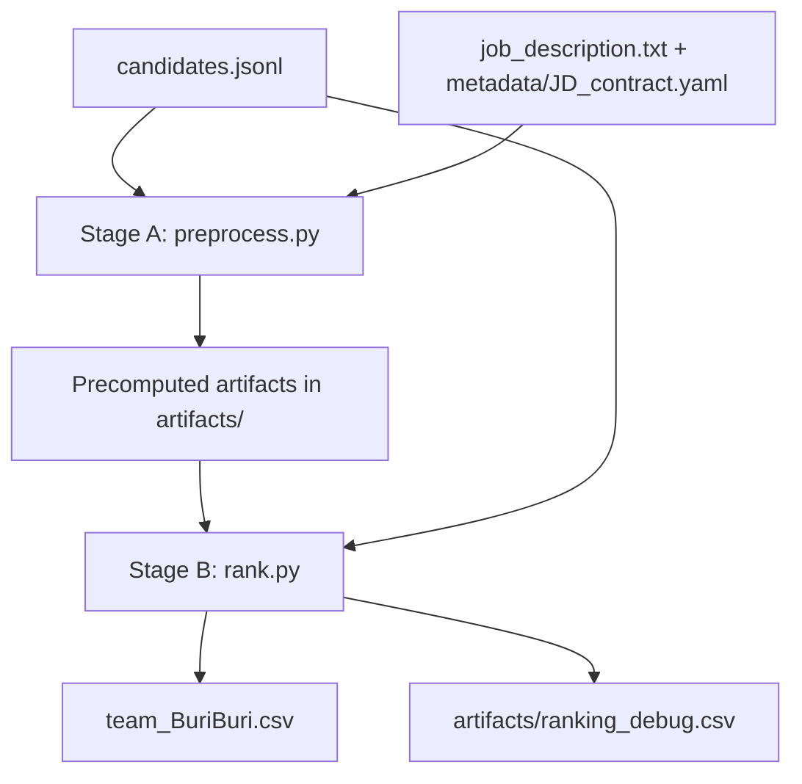
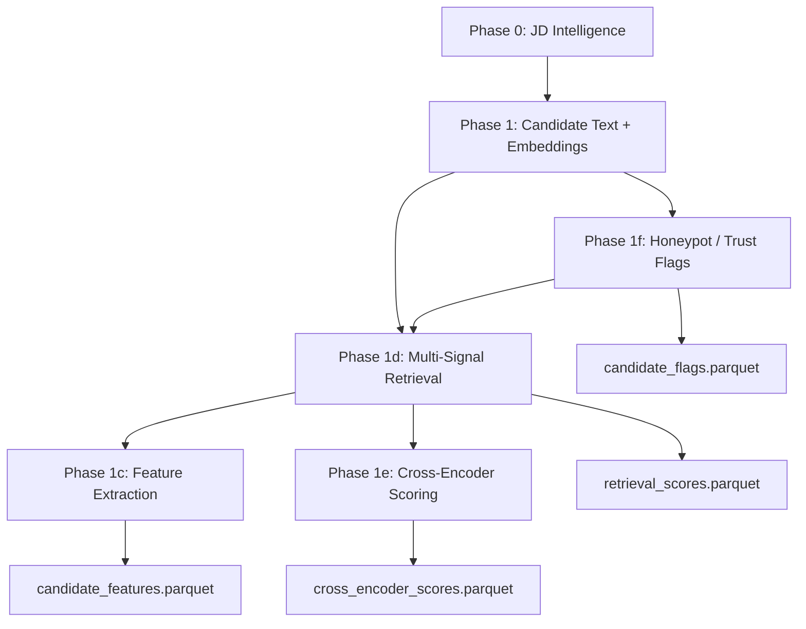
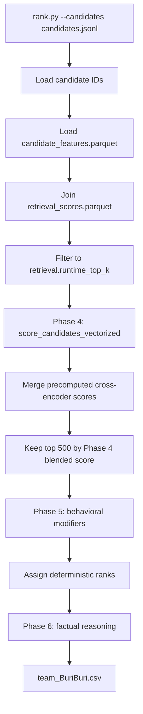
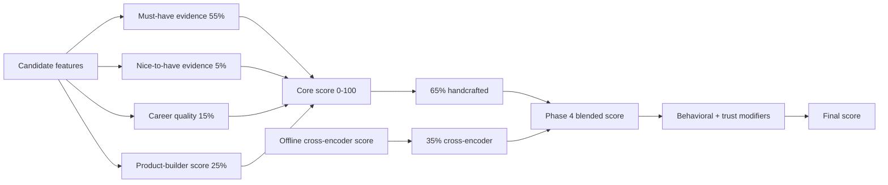
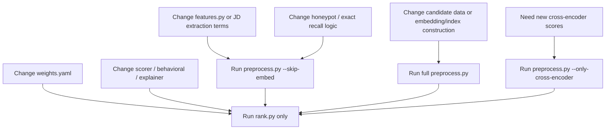

# Evidence Rank Architecture

This document explains how Team BuriBuri's Redrob ranking engine works end to end. It is written for code reviewers, evaluators, and team members who need to understand and defend the implementation.

## Design Goal

The JD is for a founding-team Senior AI Engineer who will own candidate-role matching, retrieval, ranking, and evaluation systems. The system therefore does not simply search for generic AI keywords. It tries to identify candidates who have actually built production retrieval, search, recommendation, ranking, hybrid search, and ranking-evaluation systems.

The submission spec makes top-rank quality the main target:

| Metric | Weight | Meaning |
|---|---:|---|
| NDCG@10 | 0.50 | Quality and order of the top 10 |
| NDCG@50 | 0.30 | Quality and order of the top 50 |
| MAP | 0.15 | Precision across the ranked list |
| P@10 | 0.05 | Fraction of top 10 that are relevant |

The architecture is built around that reality: high recall first, then careful top-100 reranking, with factual reasoning for manual review.

## High-Level Flow



The expensive work is in `preprocess.py`. The final competition path is `rank.py`, which only reads artifacts and writes the final CSV.

## Stage A: Offline Preprocessing

Stage A can use GPU and can take longer. It produces reusable artifacts that make final ranking fast and reproducible.



### Phase 0: JD Intelligence

Code:

- `src/jd_intelligence.py`
- `metadata/JD_contract.yaml`
- `job_description.txt`

Outputs:

- `artifacts/jd_config.json`
- `artifacts/jd_keywords.json`
- `artifacts/jd_v1_skills.npy`
- `artifacts/jd_hyde_recsys.npy`
- `artifacts/jd_hyde_eval.npy`
- `artifacts/jd_sparse_queries.npz`

What happens:

- Reads the JD and structured YAML contract.
- Builds dense JD query text for BGE-M3.
- Builds HyDE-style retrieval personas for recommender/ranking and evaluation-heavy candidates.
- Builds learned-sparse JD vectors and BM25 keyword anchors.
- Disables ColBERT vectors to avoid memory-heavy artifacts.

Why:

- The JD rewards intent understanding, not keyword matching only.
- Separate query views help recall profiles that say "recommendation systems" or "ranking evaluation" without saying "RAG".

### Phase 1: Candidate Corpus Preprocessing

Code:

- `preprocess.py`
- `constants.py`

Outputs:

- `artifacts/faiss_index.bin`
- `artifacts/candidate_sparse_matrix.npz`
- `artifacts/bm25_index.pkl`
- `artifacts/candidate_texts.pkl`
- `artifacts/candidate_ids.json`

What happens:

- Serializes each candidate profile into searchable text.
- Encodes text with `BAAI/bge-m3`.
- Stores normalized dense embeddings in FAISS `IndexFlatIP`.
- Stores learned-sparse lexical weights in SciPy CSR format.
- Builds a BM25 index over normalized candidate text.

Why:

- Dense search captures semantic fit.
- Learned sparse and BM25 keep exact technical terms alive.
- Runtime ranking should not load models or rebuild indexes.

### Phase 1f: Honeypot And Trust Checks

Code:

- `preprocess.py`
- `src/features.py`
- `metadata/JD_contract.yaml`

Output:

- `artifacts/candidate_flags.parquet`

What happens:

- Reads raw JSON fields directly.
- Flags impossible timelines, negative durations, suspicious years of experience, multiple current roles, ghost profiles, consulting-only risks, research-only risks, wrong-domain risks, and target skill-duration overclaims.

Why:

- The spec warns that honeypots are forced to low relevance.
- These checks should be structural and deterministic, not embedding-based.

### Phase 1d: Multi-Signal Retrieval

Output:

- `artifacts/retrieval_scores.parquet`
- `artifacts/retrieval_scores_base.parquet`

Signals:

- dense FAISS retrieval over BGE-M3 vectors
- learned-sparse BGE-M3 CSR dot product
- BM25 lexical retrieval
- exact/regex recall lane over JD-critical terms
- Reciprocal Rank Fusion over the retrieval lists

Why:

- Dense-only retrieval misses exact evaluation/system terms.
- BM25-only retrieval misses semantic recommender/search profiles.
- RRF gives a robust high-recall candidate pool before scoring.

### Phase 1c: Feature Extraction

Code:

- `src/features.py`

Output:

- `artifacts/candidate_features.parquet`

Feature groups:

- Bucket A: retrieval/search, vector DB, evaluation, LTR/reranking, Python, LLM/RAG, distributed systems, HR-tech exposure
- Bucket B: product-company ratio, deployment language, shipper language, ownership, recency, depth, career IR density
- Bucket C: title velocity, consulting/research/wrong-domain risks, LangChain-only risk, keyword stuffing, stopped-coding risk, contradiction flags

Why:

- The final ranker needs explicit, interpretable JD features.
- The explainer also needs factual snippets copied from candidate text.

### Phase 1e: Cross-Encoder Scoring

Code:

- `src/reranker.py`
- `preprocess.py`

Output:

- `artifacts/cross_encoder_scores.parquet`

What happens:

- Runs `BAAI/bge-reranker-v2-m3` offline on the widened retrieval pool.
- Saves normalized scores for runtime merge.

Why:

- The cross-encoder adds semantic ordering quality.
- It is not run during final ranking, keeping `rank.py` fast and CPU-safe.

## Stage B: Runtime Ranking

Stage B is the official reproducible path. It should complete within 5 minutes on CPU with no network and no GPU.



### Runtime Step Details

1. `rank.py` reads candidate IDs from the input JSONL.
2. It loads `artifacts/candidate_features.parquet`.
3. It filters artifacts to the candidate IDs present in the input file.
4. It joins `artifacts/retrieval_scores.parquet`.
5. It keeps the configured runtime retrieval pool from `weights.yaml`.
6. `src/scorer.py` computes the core technical score.
7. `src/reranker.py` merges precomputed cross-encoder scores.
8. The pipeline keeps top 500 by blended Phase 4 score.
9. `src/behavioral.py` applies final reachability and trust modifiers.
10. Ranks are assigned by descending score, with deterministic tie handling.
11. `src/explainer.py` generates the final reasoning text.
12. The system writes `team_BuriBuri.csv`.

## Scoring Model



Core bucket weights from `weights.yaml`:

| Bucket | Weight |
|---|---:|
| Must-have evidence | 0.55 |
| Nice-to-have evidence | 0.05 |
| Career quality | 0.15 |
| Product-builder score | 0.25 |

Must-have sub-weights:

| Signal | Weight |
|---|---:|
| Retrieval/search evidence | 0.22 |
| Vector DB / hybrid search | 0.16 |
| Recommendation/ranking systems | 0.20 |
| Evaluation framework | 0.17 |
| Python engineering | 0.05 |

Cross-encoder merge:

| Component | Weight |
|---|---:|
| Handcrafted core score | 0.65 |
| Precomputed cross-encoder score | 0.35 |

## Behavioral And Trust Layer

Behavioral signals are late modifiers. They do not replace technical fit.

Signals include:

- last active date
- open-to-work flag
- recruiter response rate
- notice period
- location and relocation
- seniority and hands-on coding risk
- writing signal
- social proof and GitHub activity
- interview completion and offer acceptance
- profile completeness
- honeypot, ghost, and contradiction penalties

Why late modifiers:

- A technically weak but highly available candidate should not outrank a strong JD match.
- A strong but unreachable candidate should still be penalized because the JD asks for real hiring practicality.

## Reasoning Generation

The `reasoning` column is generated by `src/explainer.py`.

Rules:

- no LLM calls
- no hosted APIs
- no guessing
- profile facts come from extracted JSON fields
- evidence snippets come from candidate text snippets saved in features
- contradiction flags prevent unverified duration claims
- top candidates sound strong
- mid candidates show fit plus caveats
- lower top-100 candidates are described as partial or adjacent fits

This is intentional. Deterministic reasoning may repeat some structure, but it is safer than generative prose that could hallucinate facts.

## Output Files

Official output:

```text
team_BuriBuri.csv
```

Columns:

```text
candidate_id,rank,score,reasoning
```

Debug output:

```text
artifacts/ranking_debug.csv
```

Debug columns include:

- `candidate_id`
- `rank`
- `score`
- `core_score`
- `ce_score`
- `reasoning`
- `concern`

## Current Runtime And Output Metrics

| Metric | Current value |
|---|---:|
| Candidates in official dataset | 100000 |
| Candidates loaded from current feature artifact during rank run | 12325 |
| Runtime retrieval cutoff | 10000 |
| Phase 4 top slice | 500 |
| Final output rows | 100 |
| Runtime for latest `rank.py` run | about 2.14 seconds |
| Full tests | 94 passed |
| Submission validator | Pass |
| Reasoning factuality audit | 0 errors, 0 warnings |
| Score range in final CSV | 95.86758 to 51.063791 |
| Mean score | 66.1263 |
| Median score | 64.9965 |

## Artifact Dependency Rules



Use `rank.py` only when the change affects scoring, behavior, or explanation over existing features. Rebuild preprocessing when the change affects what features or retrieval candidates exist.

## Why This Architecture Is Defensible

The approach is built for the spec:

- Top-rank quality matters most, so the system uses high recall plus careful reranking.
- Runtime must be CPU-only and under 5 minutes, so embeddings and cross-encoder work are offline.
- Manual review checks reasoning factuality, so explanations are deterministic and evidence-grounded.
- Honeypots are a Stage 3 risk, so structural trust checks are explicit.
- The JD cares about production ranking/retrieval/evaluation, so the feature system gives those signals first-class weights.

The result is not meant to perfectly imitate every human recruiter judgment. It is a scalable approximation that is specific to the JD, reproducible under the constraints, and explainable row by row.
